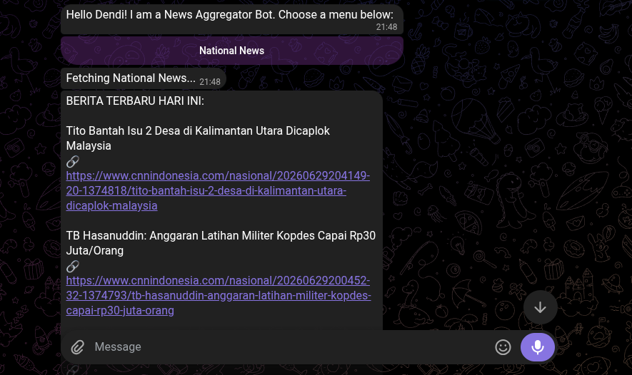
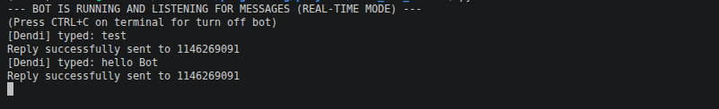

# Telegram News Aggregator Bot

A modern, real-time Telegram Bot that fetches and aggregates the latest national news. Built with Python, this project demonstrates industry-standard practices including modular architecture, REST API integration, and defensive programming.

## Features

- **Real-time Updates:** Utilizes Telegram's Long Polling method to listen and respond to users instantly.
- **Interactive UI/UX:** Replaces basic text commands with modern **Inline Keyboards** for seamless navigation.
- **API Integration:** Fetches real-time news data from trusted sources using RSS-to-JSON conversion.
- **Defensive Programming:** Implemented error handling to ensure the bot survives third-party API downtimes or rate limits.
- **Secure Configuration:** Protects sensitive credentials using Environment Variables (`.env`).
- **Modular Architecture:** Separation of concerns applied across routing, services, and API handling for high scalability.

## Tech Stack

- **Language:** Python 3.x
- **Libraries:** `requests`, `python-dotenv`
- **API:** Telegram Bot API, RSS2JSON API

## Preview






## Project Structure

```text
.
├── bot/
│   ├── services/
│   │   └── news_fetcher.py   # Handles external API requests & data parsing
│   ├── config.py             # Manages environment variables & security
│   ├── handlers.py           # Core logic and message routing
│   ├── main.py               # Long polling engine & entry point
│   └── telegram_api.py       # Telegram messaging services
├── .env.example              # Template for environment variables
├── .gitignore
├── requirements.txt
└── README.md
```
